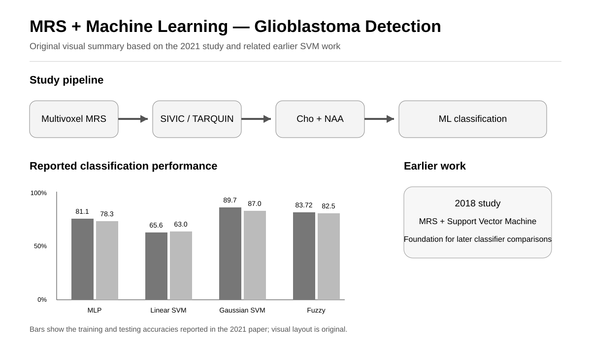
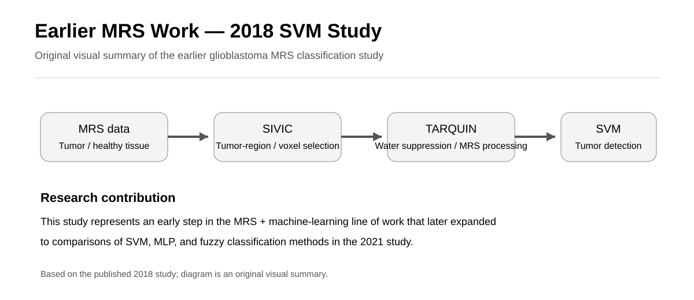

# MRS-Glioblastoma-Machine-Learning

## Semi-Automated Glioblastoma Tumor Detection Based on Different Classifiers Using Magnetic Resonance Spectroscopy





*Original visual summaries based on the published studies; performance values are taken from the reported results.*

This repository presents a research project investigating semi-automated detection of glioblastoma tumor voxels using magnetic resonance spectroscopy (MRS) and machine learning classifiers.

The study focused on identifying metabolic features from MRS data and evaluating different classification methods for distinguishing glioblastoma tumor voxels from non-tumor voxels.

## Research Question

Can metabolic features obtained from magnetic resonance spectroscopy be used with machine learning classifiers to automatically distinguish glioblastoma tumor voxels from non-tumor voxels?

## Study Focus

- Glioblastoma multiforme (GBM)
- Magnetic resonance spectroscopy (MRS)
- Multivoxel MRS
- Medical imaging
- Machine learning
- Tumor detection
- Metabolite-based classification
- Support vector machines
- Neural networks

## Study Design

MRS data were obtained from 7 patients with glioblastoma multiforme. A total of 293 voxels were analyzed using multivoxel proton magnetic resonance spectroscopy.

The MRS data were acquired using a 3 Tesla Siemens MAGNETOM Trio Tim MRI scanner with a Point-Resolved Spectroscopy (PRESS) sequence. Acquisition parameters included TE = 135 ms and TR = 1570 ms.

## MRS Processing

SIVIC was used for visualization and determination of the MRS voxel locations.

TARQUIN was used for water suppression, preprocessing, and metabolite quantification.

The metabolite features selected for classification included:

- Choline (Cho)
- N-Acetylaspartate (NAA)

## Machine Learning

Different machine learning and classification approaches were evaluated for glioblastoma tumor detection:

- Multilayer Perceptron (MLP)
- Linear Support Vector Machine (SVM)
- Gaussian Support Vector Machine (SVM)
- Fuzzy classification

The Gaussian SVM achieved the highest reported accuracy, with 89.7% for training and 87% for testing.

The fuzzy classifier using four membership functions achieved 82.5% testing accuracy. The paper also reports that increasing fuzzy membership functions improved training accuracy but that test accuracy decreased after four membership functions.

## Research Workflow

```text
Multivoxel MRS
        ↓
SIVIC
        ↓
Voxel Selection
        ↓
TARQUIN Processing
        ↓
Water Suppression
        ↓
Metabolite Quantification
        ↓
Cho + NAA
        ↓
Machine Learning Classification
        ↓
MLP / Linear SVM / Gaussian SVM / Fuzzy
        ↓
Glioblastoma Tumor Detection
```

## Earlier Work — 2018

An earlier study investigated glioblastoma detection using magnetic resonance spectroscopy and Support Vector Machine classification. It represents an initial stage of my research on MRS-based tumor detection and machine learning.

**Detection of Glioblastoma Multiforme Tumor in Magnetic Resonance Spectroscopy Based on Support Vector Machine**

## Software and Tools

- SIVIC
- TARQUIN
- MATLAB
- Machine Learning Classifiers

## Publications

Faramarzi, A., Loghmani, N., Moqadam, R., Allahverdy, A., & Siyah Mansoory, M. (2021).

**Semi-Automated Glioblastoma Tumor Detection Based on Different Classifiers Using Magnetic Resonance Spectroscopy.**

*Frontiers in Biomedical Technologies, 8*(3), 183–190.

- [Read the article](https://publish.kne-publishing.com/index.php/fbt/article/view/7113)
- [DOI](https://doi.org/10.18502/fbt.v8i3.7113)

**Earlier 2018 study:** [Detection of Glioblastoma Multiforme Tumor in Magnetic Resonance Spectroscopy Based on Support Vector Machine](https://ijmp.mums.ac.ir/article_12927.html)

## Author

**Ayob Faramarzi**

Biomedical Engineering | Neuroimaging | fMRI | MRS | Brain Connectivity | Machine Learning

[Google Scholar](https://scholar.google.com/citations?hl=en&user=1uivc_4AAAAJ)

[LinkedIn](https://www.linkedin.com/in/ayob-faramarzi/)
